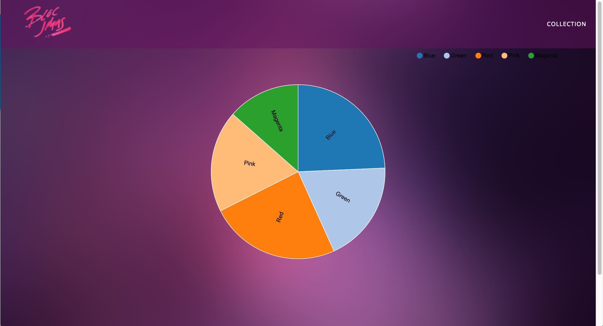
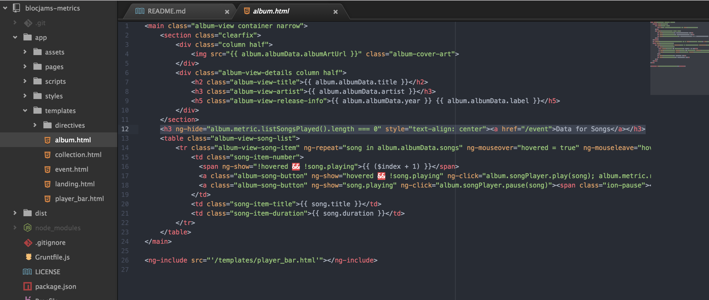
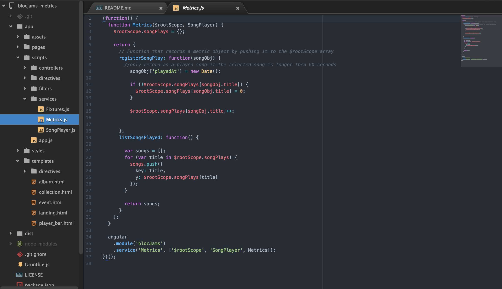

# Blocjams-metrics
An extension for [Bloc-jams-angular](https://github.com/FrozenMeatloaf/bloc-jams-angular) project.  Extension is an analytics service and reporting tool using the D3.js visualization library.

## information

* utilizes http://krispo.github.io/angular-nvd3/#/
* data link will **not** display in album.html unless one song is at least played
* modify "length of song played" in metric service to adjust when data is recorded.

## images

**data screenshot**

**album.html modification**

**Bloc-jams collection**

